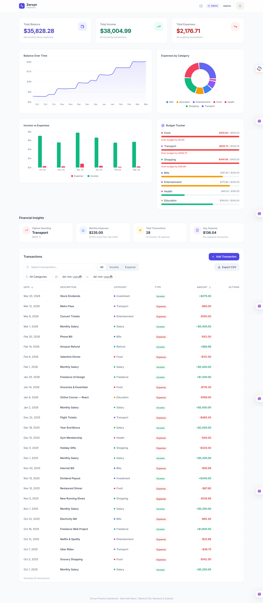
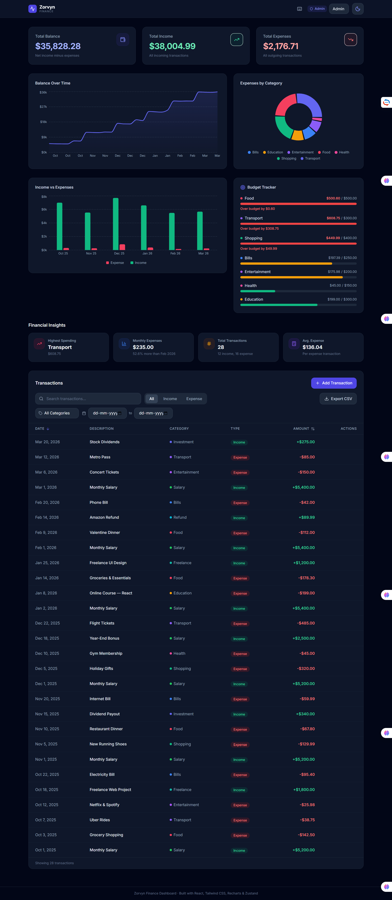

# Zorvyn Finance Dashboard

A modern, responsive finance dashboard built as a frontend developer assessment. Demonstrates clean component architecture, centralized state management, thoughtful UI/UX design, and attention to detail — built with a production-quality fintech SaaS aesthetic.


> 🔗 **Live Demo**: [zorvyn-finance-dashboard.vercel.app](https://zorvyn-finance-dashboard.vercel.app) 

### Preview

| Light Mode | Dark Mode |
|---|---|
|  |  |

---

## Features

### Dashboard Overview
- **Summary Cards** — Total Balance, Total Income, and Total Expenses with animated count-up values, color-coded metrics (indigo, green, red), and responsive font scaling
- **Balance Over Time** — Interactive area chart with gradient fill showing running balance across all transactions
- **Expenses by Category** — Donut chart breaking down spending by category with percentage tooltips
- **Income vs Expenses** — Grouped monthly bar chart comparing income and expense trends over time

### Transactions
- Full-featured data table with **search**, **type filter** (All / Income / Expense), **category filter**, **date range picker**, and **sortable columns** (Date, Amount)
- Color-coded amount display (+green for income, -red for expenses) with category color dots
- Type badges for quick visual identification
- **CSV export** of filtered transactions
- Responsive column hiding on smaller screens
- "Clear filters" shortcut when advanced filters are active

### Role-Based UI (Frontend Simulation)
- Toggle between **Admin** and **Viewer** roles via dropdown in the header
- **Admin** can add, edit, and delete transactions; edit budget limits
- **Viewer** can only view — all mutating controls are conditionally hidden
- Role badge updates dynamically with icon (Shield / Eye)

### Budget Tracker
- Per-category **spending progress bars** with color-coded status (green/amber/red)
- **Editable budget limits** (admin only) with inline editing
- Over-budget warnings with exact overage amount
- Budgets persist independently to LocalStorage

### Financial Insights
Four insight cards computed from live transaction data:
- **Highest Spending Category** — identifies the top expense category
- **Monthly Expense Comparison** — shows current month total with trend vs previous month
- **Total Transactions** — count with income/expense breakdown
- **Average Expense** — per expense transaction

### UX Polish
- **Animated number counters** — Summary card values count up from $0 on load with ease-out cubic animation
- **Skeleton loading state** — Full-page pulse animation matching the dashboard layout during initial hydration
- **Toast notifications** — Success, error, info, and undo toasts for all CRUD actions
- **Undo delete** — Deleted transactions can be restored via toast "Undo" button within 6 seconds
- **Delete confirmation dialog** — Warning dialog before destructive actions
- **Keyboard shortcuts** — Power user shortcuts with toggleable help panel:
  - `N` — Add Transaction (admin only)
  - `D` — Toggle Dark Mode
  - `/` — Focus Search
  - `1` / `2` / `3` — Filter All / Income / Expense
  - `Escape` — Clear search

### Dark Mode
- Full dark mode support toggled via sun/moon button in the header
- Smooth color transitions across all components
- Persisted across sessions via LocalStorage

### Data Persistence
- All transactions, role selection, and dark mode preference persist in LocalStorage via Zustand's `persist` middleware
- Budget limits persist independently
- Data hydrates automatically on page load

---

## Tech Stack

| Technology | Purpose |
|---|---|
| **React 19** | Component-based UI library |
| **Vite 8** | Build tool and dev server |
| **Tailwind CSS 3** | Utility-first CSS framework with custom theme |
| **Recharts** | Composable charting library (Area, Pie, Bar charts) |
| **Zustand 5** | Lightweight state management with persist middleware |
| **Lucide React** | Modern icon library |
| **Inter** | Google Font for clean SaaS typography |

---

## Project Structure

```
src/
├── components/
│   ├── AddTransactionModal.jsx   # Modal form for add/edit transactions
│   ├── BudgetTracker.jsx         # Per-category budget progress bars
│   ├── ConfirmDialog.jsx         # Delete confirmation dialog
│   ├── DarkModeToggle.jsx        # Sun/moon toggle with animation
│   ├── EmptyState.jsx            # Reusable empty state component
│   ├── Filters.jsx               # Search, type pills, category dropdown, date range
│   ├── Insights.jsx              # Financial insights cards
│   ├── RoleToggle.jsx            # Admin/Viewer role switcher
│   ├── Skeleton.jsx              # Loading skeleton for all dashboard sections
│   ├── SummaryCard.jsx           # Animated metric card with count-up
│   ├── Toast.jsx                 # Toast notification UI
│   ├── TransactionTable.jsx      # Data table with sort/filter/actions
│   └── charts/
│       ├── BalanceLineChart.jsx   # Area chart — balance over time
│       ├── ExpensePieChart.jsx    # Donut chart — expenses by category
│       └── MonthlyComparisonChart.jsx # Bar chart — income vs expenses
├── data/
│   └── mockData.js               # 28 mock transactions + category constants
├── hooks/
│   ├── useCountUp.js             # Animated number counter hook
│   └── useKeyboardShortcuts.js   # Global keyboard shortcuts
├── pages/
│   └── Dashboard.jsx             # Main page layout (header + sections)
├── store/
│   ├── useFinanceStore.js        # Main Zustand store + persistence
│   └── useToastStore.js          # Toast notification state
├── utils/
│   ├── calculations.js           # Pure financial calculation functions
│   ├── categoryColors.jsx        # Category color system with dot/badge components
│   └── csv.js                    # CSV export utility
├── App.jsx                       # Root component with dark mode hydration
├── index.css                     # Tailwind directives + custom component classes
└── main.jsx                      # Entry point
```

---

## State Management

The app uses a single **Zustand store** (`useFinanceStore`) that manages:

- **`transactions`** — Array of transaction objects (CRUD operations)
- **`searchQuery`** — Current search string
- **`filterType`** — Active type filter (`all` | `income` | `expense`)
- **`filterCategory`** — Active category filter (`all` | category name)
- **`dateRange`** — Date range filter (`{ from, to }`)
- **`sortBy`** / **`sortOrder`** — Active sort field and direction
- **`role`** — Current user role (`admin` | `viewer`)
- **`darkMode`** — Dark mode toggle state

A separate **toast store** (`useToastStore`) manages notification state independently.

### Why Zustand?
- Minimal boilerplate compared to Redux
- No context providers needed — direct hook-based access
- Built-in `persist` middleware for LocalStorage integration
- Clean action pattern without reducers

### Derived Values
Financial summaries (totals, insights) are computed from raw transaction data using pure utility functions in `calculations.js`. Filtered/sorted transaction lists are computed inside components via `useMemo` for stable rendering — avoiding Zustand v5's `useSyncExternalStore` infinite loop pitfall with selectors that return new references.

---

## Role-Based UI

Role switching is **frontend-only** — it simulates access control without a backend:

| Feature | Admin | Viewer |
|---|---|---|
| View transactions | ✅ | ✅ |
| View charts & insights | ✅ | ✅ |
| Add transaction | ✅ | ❌ |
| Edit transaction | ✅ | ❌ |
| Delete transaction | ✅ | ❌ |
| Edit budget limits | ✅ | ❌ |

---

## Design Decisions

- **No sidebar** — Single-page dashboard with a sticky header keeps the layout clean and maximizes content space
- **Custom Tailwind theme** — Extended color tokens (`brand`, `income`, `expense`, `surface`) ensure consistent theming across light and dark modes
- **CSS component classes** — Reusable `.card`, `.btn-primary`, `.btn-secondary`, `.input`, `.badge` classes reduce repetition
- **`useMemo` over Zustand selectors** for derived arrays — Zustand v5 uses `useSyncExternalStore` which requires stable references
- **Hover-reveal actions** — Edit/delete buttons appear on row hover, keeping the table clean
- **Glassmorphism header** — `backdrop-blur-lg` with semi-transparent background creates a premium feel
- **Toast with undo** — Instead of permanent deletes, users get a 6-second undo window (product-level UX)
- **Budget tracker** — Shows spending awareness without requiring complex backend logic

---

## How to Run

```bash
# Clone the repository
git clone https://github.com/yourusername/zorvyn-finance-dashboard.git
cd zorvyn-finance-dashboard

# Install dependencies
npm install

# Start development server
npm run dev

# Build for production
npm run build

# Preview production build
npm run preview
```

The app runs at `http://localhost:5173` by default.

---

## Deployment

This project is ready to deploy on **Vercel**:

1. Push to GitHub
2. Import project in [vercel.com](https://vercel.com)
3. Framework: **Vite** (auto-detected)
4. Build command: `npm run build`
5. Output directory: `dist`

---

## Testing

Unit tests are written with **Vitest** for all pure utility functions:

```bash
# Run all tests
npm test

# Run in watch mode
npm run test:watch
```

### Test Coverage

| Test File | What's Tested | Test Cases |
|---|---|---|
| `calculations.test.js` | All financial utilities (totals, balance, categories, formatting) | 20+ cases |
| `useFinanceStore.test.js` | Filter logic (type, search, sort, category, date range, combined) | 15+ cases |

Edge cases covered include: empty arrays, zero values, negative balances, whitespace in search, combined filter scenarios, and boundary date ranges.

---

## Browser Support

Tested on modern browsers (Chrome, Firefox, Safari, Edge). Requires JavaScript enabled.

---

Built with care by a frontend engineer who believes dashboards should be both functional and beautiful.

